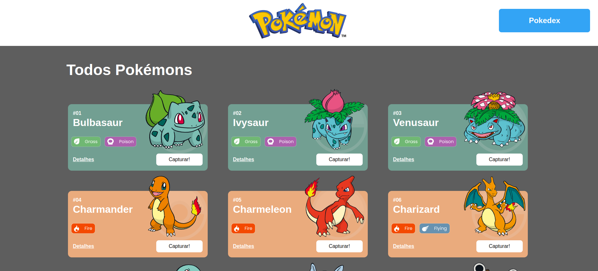
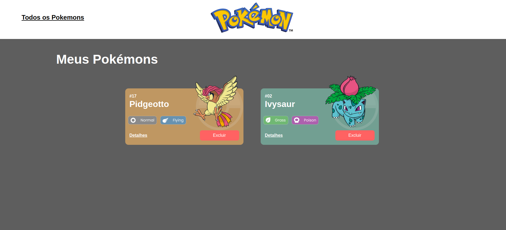
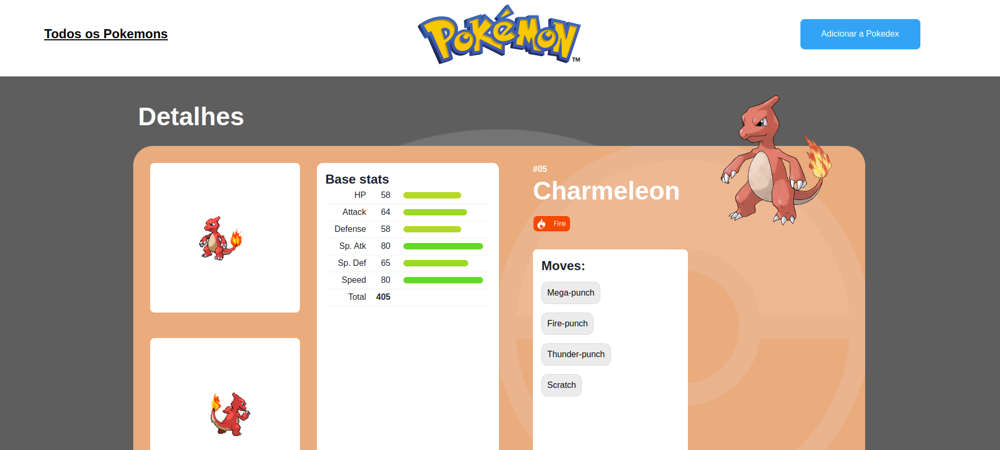
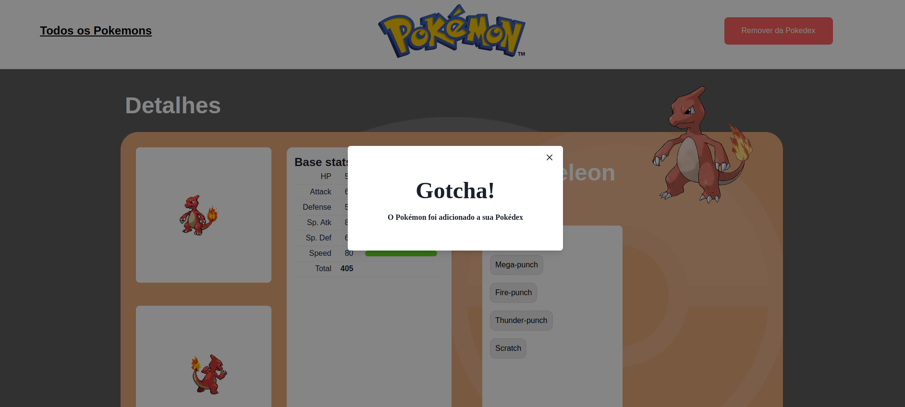
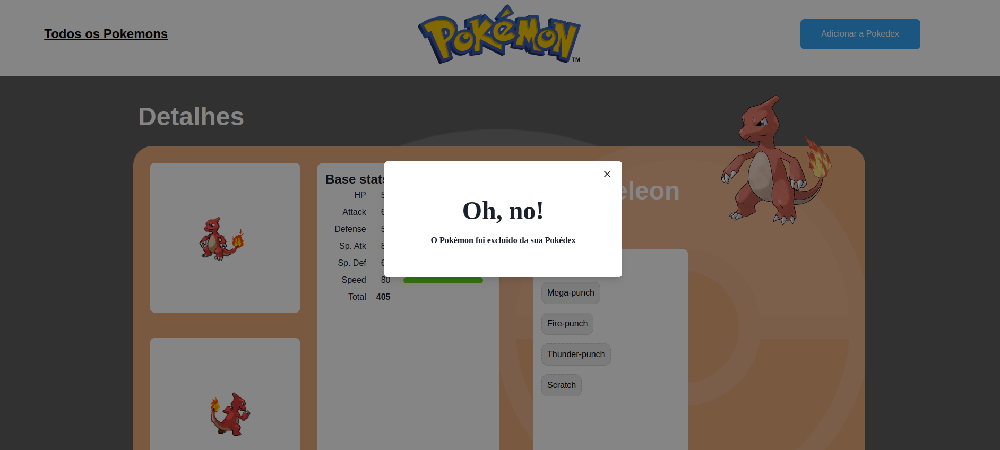
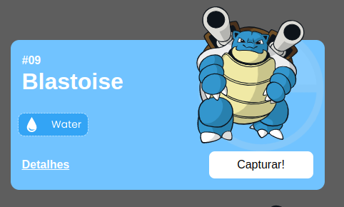
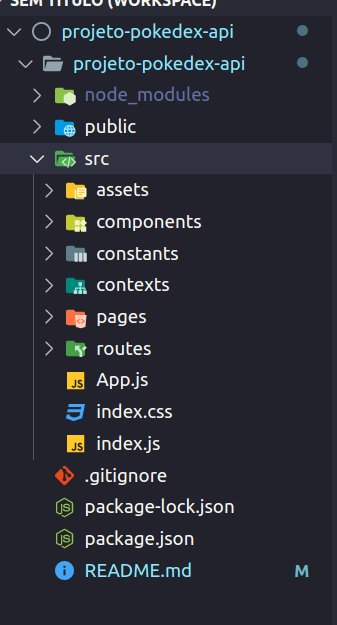

<h1 align="center">Pokedex</h1>

## Índice

- [Link de Acesso](#Link-de-Acesso)
- [Resumo do Projeto](#Resumo-do-projeto)
- [Definição do Produto e Funcionalidade](#Definição-do-Projeto-e-Funcionalidade)
- [Lista de Requisitos](#Lista-de-Requisitos)
- [Instalação](#Instalação)
- [Iniciando](#Iniciando)
- [Tecnologias e Ferramentas Utilizadas](#Tecnologias-e-Ferramentas-Utilizadas)
- [Estrutura do projeto](#Estrutura-do-projeto)

## Link de Acesso

Link surge: [projeto-pokedex](projeto-pokedex-api-rose.vercel.app/)

## Resumo do Projeto

O projeto "Pokedex" oferece uma experiência completa de exploração de Pokémon. Com recursos de captura, os usuários podem adicionar novos Pokémon à sua coleção. Além disso, detalhes abrangentes sobre cada Pokémon, como estatísticas e habilidades, podem ser visualizados. A flexibilidade de excluir Pokémon da coleção também está disponível. Essa aplicação proporciona uma jornada envolvente para os fãs, permitindo que interajam com os Pokémon de maneiras diversas e significativas.

O projeto terá como fonte de dados para a sua criação a [Poke Api](https://pokeapi.co/ "Poke Api"), uma Api pública, muito usada para aplicações focadas em aprendizado de programação e também usada em cases de processos seletivos.

Os conteúdos principais a serem estudados são:

Integração de APIs
React Router
Design Systems
Estado Global

## Definição do Produto e Funcionalidade

## `PokemonListPage`

## 

- Na PokemonListPage o usuário tem a possibilidade de visuálizar os pokemons, com recursos de capturar, visualizar detalhamento e verificar a sua pokedex personalizada.

## `PokedexPage`

## 

- Na PokedexPage o usuário tem a possibilidade de visualizar todos os pokemons capturados, com recursos de excluir e vialuzar detalhamento, atualizando a página seus dados permaneceram salvos.

## `PokemonDetailPage`

## 

- Na PokemonDetailPage o usuário tem a possibilidade de visualizar todos os detalhes do pokemon, com recursos de capturar caso ele já não esteja na sua pokedex ou excluir se ele já estiver nela.

## `Modal Adicionar`

## 

- Ao capturar o seu pokemon uma mensagem será exibida, detalhando que o usuário adicionou a sua pokedex.

## `Modal Excluir`

## 

- Ao excluir o seu pokemon uma mensagem será exibida, detalhando que o usuário excluiu da sua pokedex.

## `Card`

## 

- O botão `detalhes` Direciona para página onde será possível ver todos os dados e adicionar e/ou remover o pokemon da pokedex.
- O botão `Capturar` Captura o pokemon selecionado e o envia para pokedex.

## Instalação

- Node.js
- npm

Para instalar as dependências no diretório do seu projeto, execute o seguinte comando:

- npm install

## Iniciando

Para iniciar o aplicativo, execute o seguinte comando:

- npm run start

## Tecnologias e Ferramentas Utilizadas

Este site foi construído com as seguintes tecnologias:

- React
- React-Hooks
- React-Router-Dom
- React useContext
- Api-rest
- Axios
- Styled-Components
- Chakra UI
- React-icons

## Estrutura do projeto

#### Arquivo src

Contém todas as pastas e arquivos do projeto.

#### Pasta assets

Contém todas as imagens dos types dos pokemons e outras usadas neste projeto.

#### Pasta Components

Contém:

- `PokemonCard` -> renderiza informações e botões para pokemon.
- `Header` -> cada página terá um header com uma interface específica.
- `Modal` -> é ativado quando adiciona ou remove pokemon da pokedex.
- `Loading` -> é ativado quando realiza o carregamento da página.

#### Pasta constants

Contém a Url padrão da API utilizada.

### Pasta contexts

Contém os arquivos de contexto utilizado no projeto.

#### Pasta Pages

Contém:

- `PokemonListPage` -> Página inicial, onde haverá a lista de pokemons para interagir.
- `PokemonDetailPage` -> detalhes do pokemon selecionado.
- `PokedexPage` - Página onde terá os pokemons adicionados.

#### Pasta routes

Contém :

- `coordinator` -> retorna funções (buttons) para navegação entre as páginas . Utilizando parâmetros para seu destino.
- `Router`-> Componente que armazena o controle das páginas , identificando cada uma com um valor que é passado para `coordinator` e será utilizado no `App.js`
